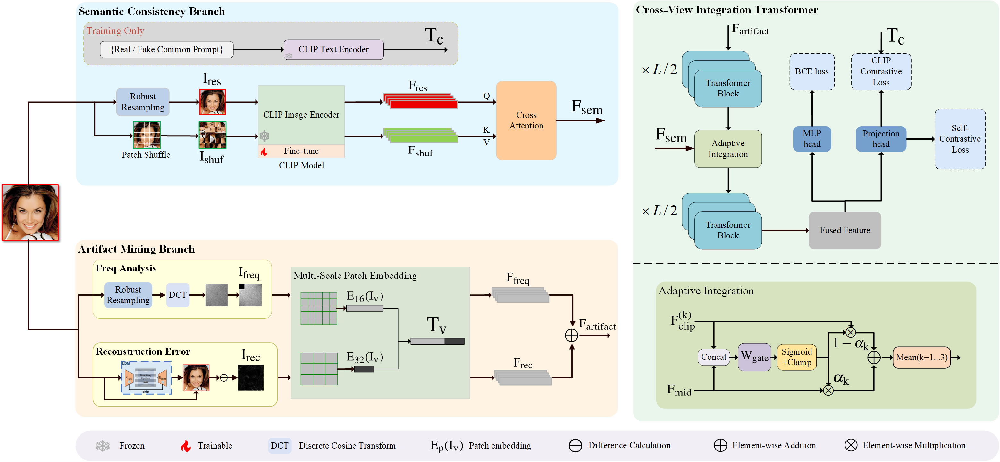

### Enhancing Generalized Deepfake Detection via Multi-View Adaptive Feature Integration



## Environment setup
**Classification environment:** 
We recommend installing the required packages by running the command:
```sh
pip install -r requirements.txt
```

## Getting the dataset
| Datasets & Materials |                                                 Link                                                 |      
|:-------------------------------------------------------------------------------------------------------------------------------------:|:----------------------------------------------------------------------------------------------------:|
|Train | [Baidu Disk]([wait to upload])
|Test | [Baidu Disk]([wait to upload])
We use AI_Face (https://github.com/Purdue-M2/AI-Face-FairnessBench) for train and in-domain test, and you can download it from the original project page. After downloading all the necessary files, please put them into the ``dataset`` folder, with the data structure in the ``dataset`` folder as 
organize the data as below:
```
dataset/
|-- test
|   |-- MMD_GAN
|   |   |-- 0_real
|   |   `-- 1_fake
|   |-- MSG_STYLE_GAN
|   |   |-- 0_real
|   |   `-- 1_fake
|   |-- STARGAN
|   |   |-- 0_real
|   |   `-- 1_fake
|   |-- ...
|-- train
|   |-- AttGAN
|   |   |-- 0_real 
|   |   `-- 1_fake
|   |-- Palette
|   |   |-- 0_real
|   |   `-- 1_fake
|   |-- ProGAN
|   |   |-- 0_real
|   |   `-- 1_fake
|   |-- SD_v15
|   |   |-- 0_real
|   |   `-- 1_fake
|   |-- StyleGAN2_FFHQ
|   |   |-- 0_real
|   |   `-- 1_fake
|   `-- latent_diffusion_FFHQ
|       |-- 0_real
|       `-- 1_fake
|-- val
|   |-- dalle2
|   |-- midjourney
|   `-- stylegan3
```
Diffusion Face dataset is available at [https://github.com/Rapisurazurite/DiffFace],
DFFD dataset is available at [http://cvlab.cse.msu.edu/dffd-dataset.html],
DiFF dataset is available at [https://github.com/iLearn-Lab/MM24-DiFF].


## Train the model 
```sh
python train.py --name trainging_name --dataroot /path/to/dataset --batch_size 64 --loss_freq 400 --lr 0.00001 --niter 50
```

## Test the detector
Modify the dataroot in test.py.
```sh
python test.py --model_path ./best.pth  --batch_size 64
```